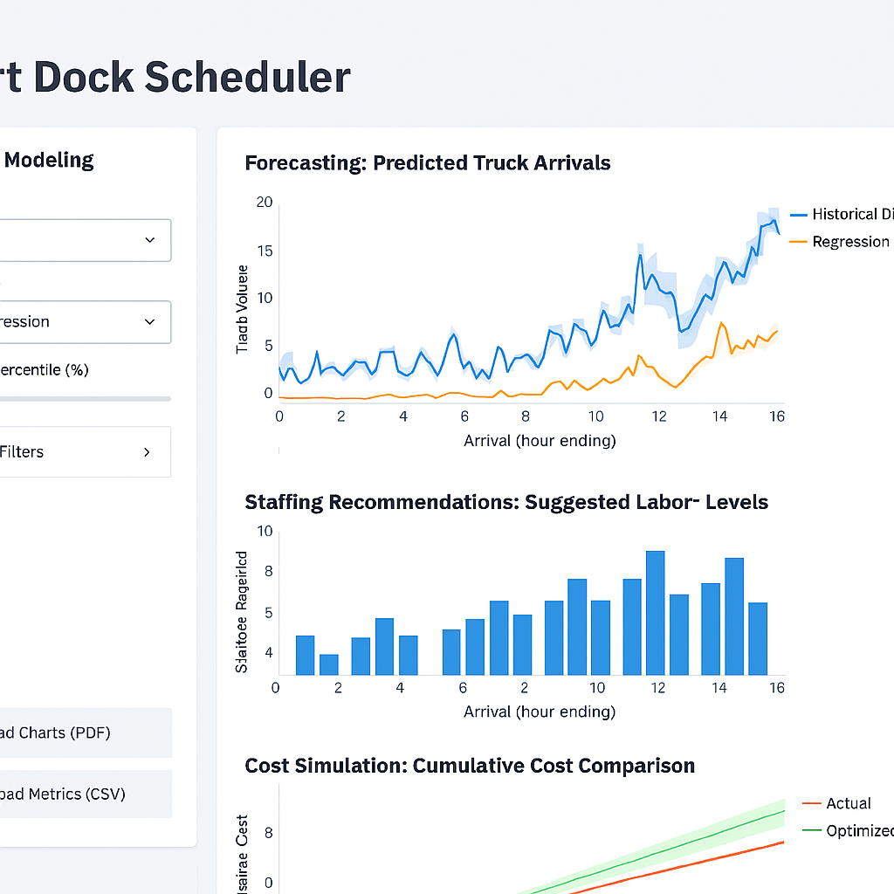

# 🚢 Smart Dock Scheduler
[](https://smart-dock-scheduler-5flpfuzsx7smkteaixb5dw.streamlit.app/)


> Optimize dock staffing, reduce delays, and simulate cost impact—all in one interactive dashboard.

A data-driven dashboard for optimizing ship dock staffing at Amazon Fulfillment Centers. It leverages operational metrics—like truck schedules, labor share history, and workload forecasts—to recommend efficient staffing levels, reduce delays, and improve labor utilization.

---

## 📊 Features

- **Forecasting**: Predict truck arrivals using linear regression
- **Staffing Recommendations**: Suggest optimal labor levels based on forecasted workload
- **Cost Simulation**: Compare actual vs. optimized staffing costs
- **Scenario Modeling**: Toggle between presets to explore operational trade-offs
- **Service Level Impact**: Visualize how staffing affects throughput and delay risk
- **Export Options**: Download charts and metrics for reporting

---

## 🚀 Setup Instructions

1. Clone the repository:
   ```bash
   git clone https://github.com/shenean7-max/smart-dock-scheduler.git
   cd smart-dock-scheduler
2. Create and activate a virtual environment:
   python -m venv venv
   .\venv\Scripts\activate  # On Windows
3. Install Dependencies
   pip install -r requirements.txt
4. Launch the dashboard:
   streamlit run dashboard.py

### 🧠 Optional Additions

- Add a **Tech Stack** section to highlight technologies used
- Consider a **Contributing** section for collaborators
- Add a **Screenshots** section to showcase the dashboard UI

## 🛠️ Tech Stack
- Python
- Streamlit
- Pandas, NumPy, Scikit-learn
- Altair (for charting)

## 🖼️ Screenshots


*Smart Dock Scheduler in action—forecasting arrivals and simulating staffing costs.*

## 🧭 Project Reflection

Building Smart Dock Scheduler taught me how to translate operational challenges into data-driven solutions. From forecasting truck arrivals to simulating cost impact, I focused on usability, scenario modeling, and recruiter-grade polish. Every feature—from export buttons to service level analysis—was designed to bridge insight and action.

This project reflects my passion for smart infrastructure, ethical tech deployment, and building tools that make real-world decisions easier.

## 🤝 Contributing

Contributions, feedback, and feature suggestions are welcome!  
Feel free to fork the repo, open issues, or submit pull requests.

